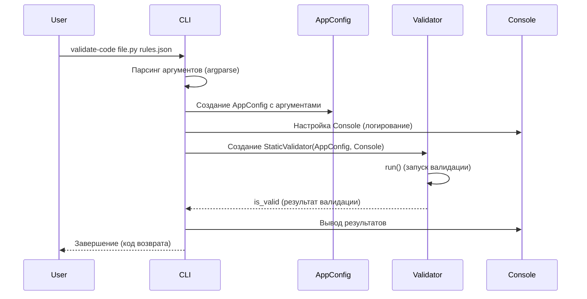

# Chapter 1: CLI (Command-Line Interface)

Добро пожаловать в `PythonCodeValidator`! Это первая глава, и мы начнем с основ: CLI или Command-Line Interface.

Представьте, что у вас есть красивая игрушка, но у нее нет кнопок. Как вы будете с ней играть? CLI — это как раз те
самые кнопки и рычаги управления вашей программой, расположенные в командной строке (терминале).

**Что такое CLI и зачем он нужен?**

CLI — это Command-Line Interface, или интерфейс командной строки. Он позволяет вам взаимодействовать с программой, вводя
команды в терминале вашего компьютера.

**Центральный пример использования:**

Представьте, что вы хотите проверить свой Python-код на соответствие определенным правилам. Без CLI вам пришлось бы
запускать программу валидатора через редактор кода и, возможно, изменять код программы, чтобы указать, какой файл
проверить. Это неудобно!

CLI позволяет вам просто открыть терминал, ввести команду, например:

```bash
validate-code my_solution.py rules.json
```

и программа `PythonCodeValidator` проверит файл `my_solution.py` на соответствие правилам, описанным в `rules.json`. Это
гораздо быстрее и проще!

**Основные понятия CLI:**

1. **Команда:** Это то, что вы вводите в терминале, чтобы запустить программу и указать, что ей делать. В нашем примере
   команда — `validate-code`.

2. **Аргументы:** Это дополнительная информация, которую вы передаете команде. В нашем примере аргументы —
   `my_solution.py` и `rules.json`. Аргументы позволяют вам указать, какой файл нужно проверить и какие правила
   использовать.

3. **Опции (или флаги):** Это специальные аргументы, которые изменяют поведение команды. Они обычно начинаются с `-` или
   `--`. Например, `--silent` может запретить вывод сообщений в консоль, а `--log-level` - изменить уровень
   журналирования.

**Как использовать CLI для `PythonCodeValidator`:**

Чтобы воспользоваться CLI `PythonCodeValidator`, нужно установить пакет (предположим, он уже установлен). Затем,
откройте терминал и введите команду:

```bash
validate-code <путь_к_файлу_с_решением> <путь_к_файлу_с_правилами>
```

Замените `<путь_к_файлу_с_решением>` на путь к вашему Python-файлу, а `<путь_к_файлу_с_правилами>` на путь к файлу с
правилами валидации в формате JSON.

**Пример:**

Если ваш файл с кодом называется `my_program.py` и находится в текущей папке, а файл с правилами называется
`my_rules.json` и тоже находится в текущей папке, то команда будет выглядеть так:

```bash
validate-code my_program.py my_rules.json
```

**Что произойдет при выполнении команды?**

Программа `PythonCodeValidator` прочитает файл `my_program.py`, проверит его на соответствие правилам, указанным в
`my_rules.json`, и выведет результаты в терминал. Вы увидите сообщения об ошибках или подтверждение успешной валидации.

**Пример использования опций:**

Чтобы подавить вывод в консоль, используйте опцию `--silent`:

```bash
validate-code my_program.py my_rules.json --silent
```

В этом случае программа будет работать "молча", и вы увидите только ошибки (если они есть) в лог-файле (если настроено
логирование).

Чтобы изменить уровень логирования на более подробный (например, `DEBUG`), используйте опцию `--log-level`:

```bash
validate-code my_program.py my_rules.json --log-level DEBUG
```

**Внутренняя реализация CLI (`src\code_validator\cli.py`):**

Теперь давайте немного заглянем под капот и посмотрим, как работает CLI `PythonCodeValidator`.

**Шаги работы (без кода):**

1. **Парсинг аргументов:** Когда вы запускаете команду `validate-code ...`, CLI сначала "разбирает" введенные вами
   аргументы (пути к файлам, опции и т. д.). Он использует библиотеку `argparse` для этого.
2. **Настройка окружения:** Затем CLI настраивает окружение программы: устанавливает уровень логирования, создает объект
   конфигурации (`AppConfig`), который содержит все необходимые параметры.
3. **Запуск валидатора:**  CLI создает экземпляр класса `StaticValidator` (о котором мы поговорим
   в [Chapter 3: Валидатор (Validator)](03_валидатор__validator__.md)) и запускает процесс валидации.
4. **Обработка результатов:** CLI получает результаты валидации и выводит соответствующие сообщения в терминал. Если
   валидация прошла успешно, программа завершается с кодом `0` (успех). Если есть ошибки, программа завершается с другим
   кодом (например, `1`).
5. **Обработка ошибок:** Если во время работы возникают ошибки (например, файл не найден), CLI перехватывает их и
   выводит информативное сообщение об ошибке.

**Упрощенная диаграмма последовательности:**



**Пример кода из `src\code_validator\cli.py`:**

Давайте посмотрим на небольшие фрагменты кода, чтобы лучше понять, как это работает:

```python
import argparse


def setup_arg_parser() -> argparse.ArgumentParser:
    """Создает парсер аргументов для CLI."""
    parser = argparse.ArgumentParser(
        prog="validate-code",
        description="Validates a Python source file against a set of JSON rules.",
    )
    parser.add_argument("solution_path", type=Path, help="Path to the Python solution file to validate.")
    parser.add_argument("rules_path", type=Path, help="Path to the JSON file with validation rules.")
    return parser
```

Этот код создает парсер аргументов с помощью библиотеки `argparse`. Он определяет, какие аргументы ожидает программа (
`solution_path` и `rules_path`) и какие у них типы (в данном случае `Path`). `help` предоставляет описание для
аргументов, которое отображается при использовании опции `--help`.

```python
from .config import AppConfig, LogLevel


def run_from_cli() -> None:
    """Запускает приложение из командной строки."""
    parser = setup_arg_parser()
    args = parser.parse_args()

    config = AppConfig(
        solution_path=args.solution_path,
        rules_path=args.rules_path,
        log_level=LogLevel.WARNING,  # Задаем уровень логирования по умолчанию
        is_silent=False,  # Показывать вывод в консоли по умолчанию
        stop_on_first_fail=False,  # Не останавливаться после первой ошибки
    )

    # Запуск валидатора (пропущено для краткости)
```

Этот код получает аргументы из командной строки (`args = parser.parse_args()`) и создает объект
`AppConfig` ([Chapter 2: Конфигурация приложения (AppConfig)](02_конфигурация_приложения__appconfig__.md)), который
содержит все необходимые параметры для работы валидатора. Обратите внимание, что устанавливаются значения по умолчанию
для некоторых параметров.

**Заключение:**

В этой главе мы познакомились с CLI (Command-Line Interface) и узнали, как он используется в `PythonCodeValidator` для
запуска валидации кода из командной строки. Мы рассмотрели основные понятия CLI, научились использовать CLI для проверки
файлов и познакомились с внутренней реализацией CLI на высоком уровне. Теперь вы знаете, как "играть" с
`PythonCodeValidator`!

В следующей главе мы подробно
рассмотрим [Chapter 2: Конфигурация приложения (AppConfig)](02_конфигурация_приложения__appconfig__.md) и узнаем, как
настраивается приложение.