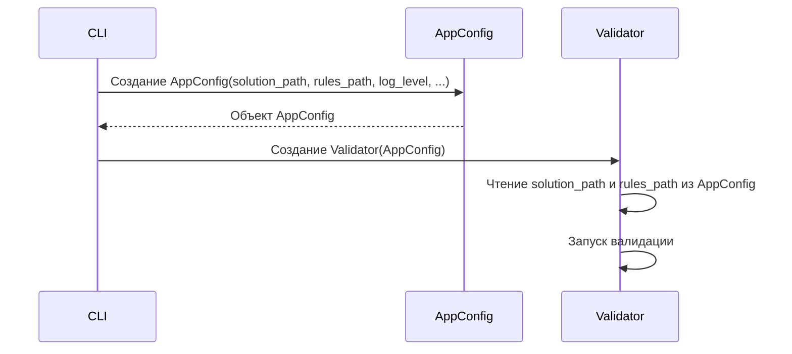

# Chapter 2: Конфигурация приложения (AppConfig)

В [Chapter 1: CLI (Command-Line Interface)](01_cli__command_line_interface__.md) мы научились запускать
`PythonCodeValidator` из командной строки. Но как программа узнает, какой файл кода нужно проверить и какие правила
использовать? Вот где на сцену выходит `AppConfig`!

Представьте, что `AppConfig` – это как инструкция для робота-валидатора. В этой инструкции записано, где лежит код,
какие правила использовать, и как подробно нужно сообщать о найденных ошибках. Без `AppConfig`, робот просто не будет
знать, что делать!

**Зачем нужен AppConfig?**

Основная проблема, которую решает `AppConfig` – это необходимость централизованно хранить и передавать все параметры,
необходимые для работы валидатора. Представьте, что вам нужно запустить валидатор для нескольких файлов с разными
наборами правил. Без `AppConfig` вам пришлось бы каждый раз передавать все параметры валидатору вручную, что очень
неудобно и чревато ошибками.

**Центральный пример использования:**

Допустим, у вас есть Python-файл с кодом `my_code.py` и файл с правилами валидации `my_rules.json`. Вы хотите проверить
`my_code.py` на соответствие правилам, описанным в `my_rules.json`, и видеть только важные сообщения об ошибках. С
помощью `AppConfig` мы можем создать объект, который содержит пути к этим файлам и уровень логирования "WARNING" (
предупреждения). Затем этот объект передается валидатору, который знает, что и как проверять.

**Ключевые концепции AppConfig:**

`AppConfig` – это контейнер для хранения настроек приложения. Давайте рассмотрим основные компоненты этого контейнера:

1. **`solution_path: Path`**: Это путь к файлу с кодом, который нужно проверить.  `Path` – это объект, представляющий
   путь к файлу или папке. Думайте об этом как об адресе вашего кода.
2. **`rules_path: Path`**: Это путь к файлу с правилами валидации. Это как список указаний для робота-валидатора: что
   можно, а что нельзя делать в коде.
3. **`log_level: LogLevel`**: Это уровень логирования. Он определяет, какие сообщения будут выводиться в консоль или
   записываться в лог-файл. Например, `LogLevel.WARNING` означает, что будут выводиться только предупреждения и ошибки,
   а `LogLevel.DEBUG` – все сообщения, включая отладочные.
4. **`is_silent: bool`**: Это флаг, определяющий, нужно ли выводить сообщения в консоль. Если `is_silent` равен `True`,
   то валидатор будет работать "молча", не выводя никаких сообщений, кроме ошибок (если настроено логирование в файл).
5. **`stop_on_first_fail: bool`**: Это флаг, определяющий, нужно ли останавливать валидацию после первой ошибки. Если
   `stop_on_first_fail` равен `True`, то валидатор остановится после обнаружения первой ошибки и не будет проверять
   остальной код.

**Как использовать AppConfig:**

Чтобы создать объект `AppConfig`, нужно импортировать его из модуля `config` и передать ему значения для каждого из
атрибутов:

```python
from pathlib import Path
from code_validator.config import AppConfig, LogLevel

config = AppConfig(
    solution_path=Path("my_code.py"),
    rules_path=Path("my_rules.json"),
    log_level=LogLevel.WARNING,
    is_silent=False,
    stop_on_first_fail=False,
)
```

Этот код создает объект `config`, который содержит пути к файлам, уровень логирования и другие параметры. Теперь этот
объект можно передать валидатору.

Предположим, файл `my_code.py` содержит синтаксическую ошибку. При запуске валидатора с созданной конфигурацией (
`config`), он выдаст сообщение об ошибке, так как уровень логирования установлен на `LogLevel.WARNING`, и флаг
`is_silent` установлен на `False`.

**Внутренняя реализация AppConfig:**

Теперь давайте посмотрим, как `AppConfig` создается и используется внутри `PythonCodeValidator`.

**Шаги работы (без кода):**

1. **Парсинг аргументов CLI:** Как мы видели
   в [Chapter 1: CLI (Command-Line Interface)](01_cli__command_line_interface__.md), CLI разбирает аргументы, переданные
   из командной строки, с помощью библиотеки `argparse`.
2. **Создание объекта AppConfig:**  CLI создает объект `AppConfig`, передавая ему значения аргументов, полученных из
   командной строки. Если какие-то аргументы не были указаны, используются значения по умолчанию.
3. **Передача AppConfig валидатору:** Объект `AppConfig` передается валидатору, который использует его для получения
   необходимой информации о файле с кодом, файле с правилами и других параметрах.
4. **Использование параметров из AppConfig:** Валидатор использует параметры из `AppConfig` для настройки процесса
   валидации: читает файлы, устанавливает уровень логирования, определяет, нужно ли останавливаться после первой ошибки
   и т.д.

**Упрощенная диаграмма последовательности:**



**Пример кода из `src\code_validator\config.py`:**

Давайте посмотрим на код, определяющий `AppConfig`:

```python
from dataclasses import dataclass
from pathlib import Path
from enum import StrEnum


class LogLevel(StrEnum):
    """Определяет допустимые уровни логирования."""
    DEBUG = "DEBUG"
    INFO = "INFO"
    WARNING = "WARNING"
    ERROR = "ERROR"
    CRITICAL = "CRITICAL"


@dataclass(frozen=True)
class AppConfig:
    """Хранит основную конфигурацию приложения из аргументов CLI."""

    solution_path: Path
    rules_path: Path
    log_level: LogLevel
    is_silent: bool
    stop_on_first_fail: bool
```

Этот код определяет класс `AppConfig` с помощью декоратора `@dataclass`.  `@dataclass` автоматически генерирует методы,
такие как `__init__`, `__repr__` и `__eq__`, что упрощает создание и использование класса.  `frozen=True` делает объект
`AppConfig` неизменяемым после создания. `LogLevel` используется для определения разрешенных уровней логирования.

**Заключение:**

В этой главе мы узнали, что такое `AppConfig` и как он используется для хранения и передачи параметров валидатору. Мы
рассмотрели основные концепции `AppConfig`, научились создавать объекты `AppConfig` и познакомились с внутренней
реализацией `AppConfig`. Теперь вы знаете, как настроить `PythonCodeValidator`!

В следующей главе мы подробно рассмотрим [Chapter 3: Валидатор (Validator)](03_валидатор__validator__.md) и узнаем, как
работает основной компонент, отвечающий за проверку кода.