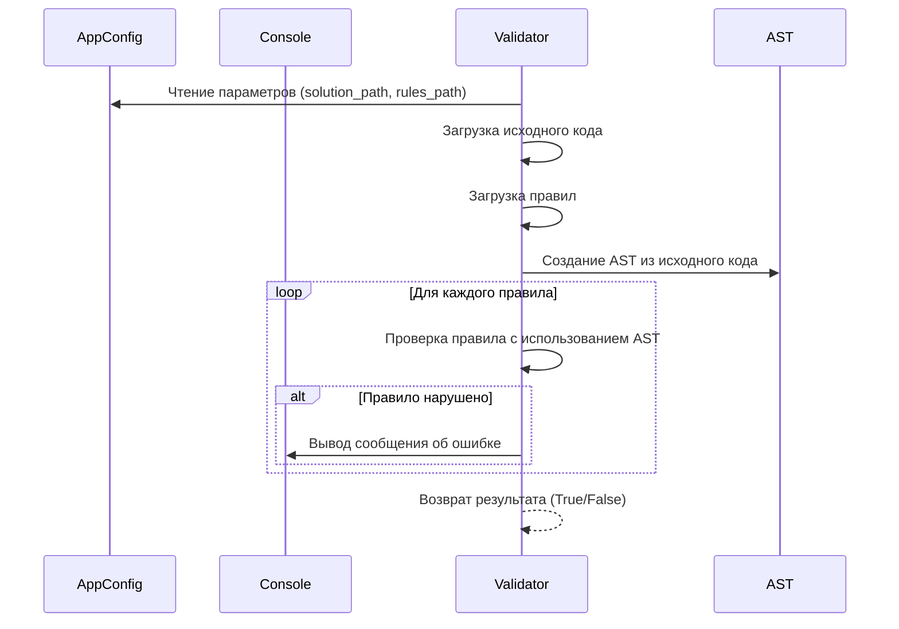

# Chapter 3: Валидатор (Validator)

В [Chapter 2: Конфигурация приложения (AppConfig)](02_конфигурация_приложения__appconfig__.md) мы узнали, как
`AppConfig` хранит конфигурацию нашего приложения. Теперь пришло время узнать, как эта конфигурация используется для
проверки кода. Встречайте: Валидатор!

Валидатор – это как строгий учитель, проверяющий домашнее задание (ваш код). Он берет ваш код и список правил (созданный
на основе [Chapter 2: Конфигурация приложения (AppConfig)](02_конфигурация_приложения__appconfig__.md)) и решает,
соответствует ли код этим правилам. Если есть ошибки, учитель (Валидатор) указывает на них.

**Зачем нужен Валидатор?**

Представьте, что вы разрабатываете программу вместе с командой. Каждый пишет свой код, но нужно убедиться, что весь код
соответствует определенному стилю и правилам. Валидатор автоматизирует эту проверку, чтобы избежать ошибок и сделать код
более понятным и поддерживаемым.

**Центральный пример использования:**

Допустим, мы хотим убедиться, что в Python-файле (`my_program.py`) обязательно определена функция `main`. Мы можем
создать правило, которое проверяет наличие этой функции. Валидатор берет этот файл, правило и проверяет, есть ли функция
`main`. Если ее нет, он сообщает об ошибке.

**Ключевые концепции Валидатора:**

1. **Исходный код (Source Code):**  Текст Python-программы, который нужно проверить. Это как текст вашего сочинения,
   который учитель читает.
2. **Правила (Rules):** Набор инструкций о том, каким должен быть код. Например: "Должна быть функция `main`", "Нельзя
   использовать глобальные переменные". Правила определяются в файле конфигурации, как мы видели
   в [Chapter 2: Конфигурация приложения (AppConfig)](02_конфигурация_приложения__appconfig__.md).
3. **AST (Abstract Syntax Tree):**  Древовидное представление кода, которое упрощает анализ. Представьте, что это "
   разобранный" код, где видны все его части (функции, классы, переменные). Мы подробнее рассмотрим AST
   в [Chapter 6: AST (Abstract Syntax Tree)](06_ast__abstract_syntax_tree__.md).
4. **Результат валидации:**  Отчет о том, какие правила были нарушены, если таковые имеются.

**Как использовать Валидатор:**

В нашем проекте `PythonCodeValidator`, Валидатор представлен классом `StaticValidator`. Чтобы его использовать, нам
нужно:

1. Создать объект `AppConfig` с конфигурацией (путь к файлу, правилам и т.д.). Мы узнали, как это делать
   в [Chapter 2: Конфигурация приложения (AppConfig)](02_конфигурация_приложения__appconfig__.md).
2. Создать объект `Console` для вывода результатов.
3. Создать объект `StaticValidator`, передав ему `AppConfig` и `Console`.
4. Запустить валидацию с помощью метода `run()`.

```python
from pathlib import Path
from src.code_validator.config import AppConfig, LogLevel
from src.code_validator.core import StaticValidator
from src.code_validator.output import Console, setup_logging

# 1. Конфигурация
config = AppConfig(
    solution_path=Path("my_program.py"),
    rules_path=Path("my_rules.json"),
    log_level=LogLevel.WARNING,
    is_silent=False,
    stop_on_first_fail=False,
)

# 2. Консоль для вывода
logger = setup_logging(LogLevel.CRITICAL)  # Настройка логирования
console = Console(logger, is_silent=False)

# 3. Валидатор
validator = StaticValidator(config, console)

# 4. Запуск валидации
is_valid = validator.run()

if is_valid:
    print("Код прошел валидацию!")
else:
    print("Код не прошел валидацию.")
```

Этот код создает экземпляр `StaticValidator`, используя конфигурацию из `config` и объект `console` для вывода. Затем он
запускает процесс валидации, вызывая метод `run()`. Результат валидации (True/False) сохраняется в переменной
`is_valid`, которую мы используем для вывода сообщения.

Предположим, файл `my_program.py` содержит следующий код:

```python
def my_function():
    print("Hello, world!")
```

А файл `my_rules.json` содержит правило, требующее наличия функции `main`:

```json
{
  "validation_rules": [
    {
      "rule_id": 1,
      "message": "Функция 'main' отсутствует!",
      "check": {
        "selector": {
          "type": "function_def",
          "name": "main"
        },
        "constraint": {
          "type": "is_required"
        }
      }
    }
  ]
}
```

В этом случае, при запуске валидатора, в консоли будет выведено сообщение "Функция 'main' отсутствует!", а переменная
`is_valid` будет равна `False`.

**Внутренняя реализация Валидатора:**

Теперь давайте посмотрим, что происходит "под капотом", когда мы запускаем валидатор.

**Шаги работы (без кода):**

1. Валидатор получает `AppConfig` и `Console`.
2. Он загружает исходный код из файла, указанного в `AppConfig`.
3. Он загружает правила валидации из файла, указанного в `AppConfig`.
4. Он преобразует исходный код в AST (Abstract Syntax Tree).
5. Для каждого правила он проверяет, соответствует ли код этому правилу.
6. Если правило нарушено, он добавляет информацию об этом в отчет об ошибках и выводит сообщение в консоль (если не
   установлен флаг `is_silent` в `AppConfig`).
7. В конце он возвращает `True`, если все правила соблюдены, и `False`, если есть хотя бы одно нарушение.

**Упрощенная диаграмма последовательности:**



**Пример кода из `src\code_validator\core.py`:**

Давайте посмотрим на некоторые фрагменты кода из `src\code_validator\core.py`, чтобы лучше понять, как работает
валидатор:

```python
class StaticValidator:
    """Orchestrates the static validation process."""

    def __init__(self, config: AppConfig, console: Console):
        """Initializes the validator with configuration and an output handler."""
        self._config = config  # Сохраняем конфигурацию
        self._console = console  # Сохраняем объект консоли
        # ... other initialization
```

Этот код показывает, как `StaticValidator` инициализируется с помощью `AppConfig` и `Console`. Он сохраняет эти объекты
для дальнейшего использования.

```python
    def run(self) -> bool:
    """Runs the entire validation process."""
    try:
        self._load_source_code()  # Загружаем код из файла
        self._load_and_parse_rules()  # Загружаем и парсим правила

        if not self._parse_ast_tree():  # Создаем AST
            return False

    except (FileNotFoundError, RuleParsingError):
        raise

    for rule in self._validation_rules:
        # check_syntax уже обработан в _parse_ast_tree, пропускаем его
        if getattr(rule.config, "type", None) == "check_syntax":
            continue

        self._console.print(f"Executing rule: {rule.config.rule_id}", level=LogLevel.DEBUG)
        is_passed = rule.execute(self._ast_tree, self._source_code)
        if not is_passed:
            self._console.print(rule.config.message, level="ERROR")
            self._failed_rules.append(rule.config.rule_id)
            if getattr(rule.config, "is_critical", False) or self._config.stop_on_first_fail:
                self._console.print("Critical rule failed. Halting validation.", level="WARNING")
                break

    return not self._failed_rules
```

Метод `run()` является сердцем валидатора. Он загружает код, правила, создает AST и затем выполняет каждое правило по
очереди. Если какое-то правило нарушено, метод выводит сообщение об ошибке и, если необходимо, останавливает валидацию.

**Заключение:**

В этой главе мы познакомились с Валидатором – ключевым компонентом `PythonCodeValidator`. Мы узнали, как он использует
`AppConfig` для получения конфигурации, загружает код и правила, создает AST и проверяет код на соответствие правилам.
Теперь вы понимаете, как работает основной механизм проверки кода!

В следующей главе мы подробно рассмотрим [Chapter 4: Правило (Rule)](04_правило__rule__.md) и узнаем, как создавать
правила для валидации кода.