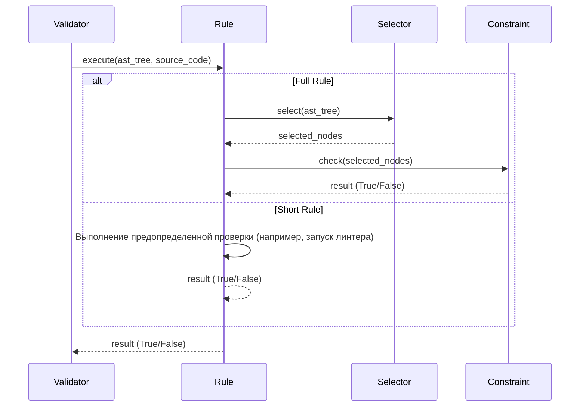

# Chapter 4: Правило (Rule)

В [Chapter 3: Валидатор (Validator)](03_валидатор__validator__.md) мы узнали, как валидатор использует конфигурацию
приложения для проверки кода. Но что именно он проверяет? С помощью чего задаются эти проверки? Ответ: с помощью Правил!

Представьте, что вы проверяете орфографию в тексте. Каждое правило орфографии, например, "после 'Ч' и 'Щ' пиши 'А' или '
У'", — это отдельное правило. В `PythonCodeValidator`, **Правило** — это аналогичная отдельная инструкция для
валидатора, говорящая, что нужно проверить в коде.

**Зачем нужны Правила?**

Основная проблема, которую решают правила, — это предоставление гибкого и расширяемого способа определения требований к
коду. Вместо того, чтобы жестко кодировать проверки внутри валидатора, мы можем определить их в виде правил и легко
добавлять, удалять или изменять их.

**Центральный пример использования:**

Допустим, вы хотите убедиться, что ваш Python-код не использует функцию `eval()`, так как она небезопасна. Вы можете
создать правило, которое проверяет наличие вызовов `eval()`. Если валидатор обнаружит вызов `eval()`, он сообщит об
этом.

**Ключевые концепции Правила:**

Давайте разберем, из чего состоит правило.

1. **Описание правила (Configuration):** Каждое правило имеет конфигурацию, которая определяет, что оно делает. Это
   похоже на рецепт: он описывает ингредиенты и шаги приготовления. Конфигурация может содержать информацию, такую как:
    * `rule_id`: Уникальный идентификатор правила.
    * `message`: Сообщение, которое будет выведено, если правило нарушено.
    * `check`: Спецификация проверки (Selector и Constraint). Мы рассмотрим Selector и Constraint чуть позже.

2. **Тип правила (Rule Type):** Правила могут быть разных типов. Например:
    * *Полное правило (Full Rule):*  Состоит из [Селектора (Selector)](07_селектор__selector__.md)
      и [Ограничения (Constraint)](09_ограничение__constraint__.md). Это наиболее гибкий тип правила.
    * *Короткое правило (Short Rule):* Выполняет предопределенную проверку, например, проверку синтаксиса или запуск
      линтера.

3. **Выполнение правила (Execution):** Правило имеет метод `execute()`, который выполняет проверку. Этот метод получает
   AST (Abstract Syntax Tree) кода и/или исходный код и возвращает `True`, если правило пройдено, и `False`, если
   правило нарушено.

**Как использовать Правило:**

В `PythonCodeValidator`, есть интерфейс `Rule` и несколько классов, которые его реализуют. Давайте рассмотрим пример
использования "полного правила", состоящего из [Селектора (Selector)](07_селектор__selector__.md)
и [Ограничения (Constraint)](09_ограничение__constraint__.md).

Допустим, мы хотим проверить, что в коде есть хотя бы одна функция с именем `calculate_tax`. Для этого нам понадобится:

* **Селектор:** Выбирает все определения функций (function definitions) с именем `calculate_tax`.
* **Ограничение:** Проверяет, что список выбранных узлов не пуст (то есть, функция `calculate_tax` существует).

Вот пример конфигурации правила (в `my_rules.json`):

```json
{
  "validation_rules": [
    {
      "rule_id": 123,
      "message": "Функция 'calculate_tax' отсутствует!",
      "check": {
        "selector": {
          "type": "function_def",
          "name": "calculate_tax"
        },
        "constraint": {
          "type": "is_required"
        }
      }
    }
  ]
}
```

Здесь `selector` указывает на то, что нужно выбрать все определения функций с именем `calculate_tax`, а `constraint`
указывает на то, что этих функций должно быть хотя бы одна.

Когда валидатор обрабатывает это правило, он сначала использует [Селектор (Selector)](07_селектор__selector__.md) для
поиска всех функций `calculate_tax` в AST. Затем он передает список найденных
функций [Ограничению (Constraint)](09_ограничение__constraint__.md), которое проверяет, что список не пуст. Если список
пуст, [Ограничение (Constraint)](09_ограничение__constraint__.md) возвращает `False`, и валидатор выводит сообщение "
Функция 'calculate_tax' отсутствует!".

**Пример короткого правила:**

Короткое правило, как правило, более простое, и часто выполняет специфическую, заранее определенную проверку. Например,
`CheckLinterRule` запускает линтер `flake8`.

```python
# src/code_validator/rules_library/basic_rules.py

class CheckLinterRule(Rule):
    # ... initialization skipped

    def execute(self, tree: ast.Module | None, source_code: str | None = None) -> bool:
        """Executes the flake8 linter on the source code via a subprocess."""
        # Запускаем flake8 как подпроцесс, передавая исходный код через stdin
        # (Linter runs in a subprocess, code skipped)
        ...
```

В этом случае `execute` метод запускает `flake8` и анализирует его вывод, чтобы определить, есть ли какие-либо нарушения
стиля кода.

**Внутренняя реализация Правила:**

Когда валидатор запускает правило, что происходит под капотом?

**Шаги работы (без кода):**

1. Валидатор получает объект `Rule` (например, `FullRuleHandler` или `CheckLinterRule`).
2. Валидатор вызывает метод `execute()` объекта `Rule`.
3. Внутри `execute()`:
    * Для полных правил:
        * Вызывается [Селектор (Selector)](07_селектор__selector__.md) для выбора узлов AST.
        * Вызывается [Ограничение (Constraint)](09_ограничение__constraint__.md) для проверки выбранных узлов.
    * Для коротких правил:
        * Выполняется предопределенная проверка (например, запуск линтера).
4. Метод `execute()` возвращает `True`, если правило пройдено, и `False`, если правило нарушено.

**Упрощенная диаграмма последовательности:**



**Пример кода из `src\code_validator\core.py` (внутри `StaticValidator.run()`):**

```python
# src/code_validator/core.py

class StaticValidator:
    # ... initialization skipped

    def run(self) -> bool:
        # ... loading code/rules/AST skipped

        for rule in self._validation_rules:
            # ... skip syntax check
            is_passed = rule.execute(self._ast_tree, self._source_code)  # Вызываем execute() у правила
            if not is_passed:
                self._console.print(rule.config.message, level="ERROR")  # Выводим сообщение об ошибке
                # ... stop on first fail logic
```

Этот код показывает, как валидатор вызывает метод `execute()` у каждого правила и обрабатывает результат.

**Пример кода из `src\code_validator\rules_library\basic_rules.py` (FullRuleHandler):**

```python
# src/code_validator/rules_library/basic_rules.py

class FullRuleHandler(Rule):
    # ... initialization skipped

    def execute(self, tree: ast.Module | None, source_code: str | None = None) -> bool:
        # ... check for AST skipped

        selected_nodes = self._selector.select(tree)  # Вызываем селектор
        return self._constraint.check(selected_nodes)  # Вызываем ограничение и возвращаем результат
```

Этот код показывает, как `FullRuleHandler` вызывает [Селектор (Selector)](07_селектор__selector__.md)
и [Ограничение (Constraint)](09_ограничение__constraint__.md) и возвращает результат.

**Заключение:**

В этой главе мы познакомились с Правилами – основными строительными блоками для определения требований к коду в
`PythonCodeValidator`. Мы узнали, что такое конфигурация правила, какие типы правил существуют, и как валидатор
выполняет правила. Теперь вы понимаете, как создавать свои собственные правила для проверки кода!

В следующей главе мы подробно рассмотрим [Chapter 5: Фабрика (Factory)](05_фабрика__factory__.md) и узнаем, как
создаются объекты правил, [Селекторов (Selector)](07_селектор__selector__.md)
и [Ограничений (Constraint)](09_ограничение__constraint__.md) динамически.