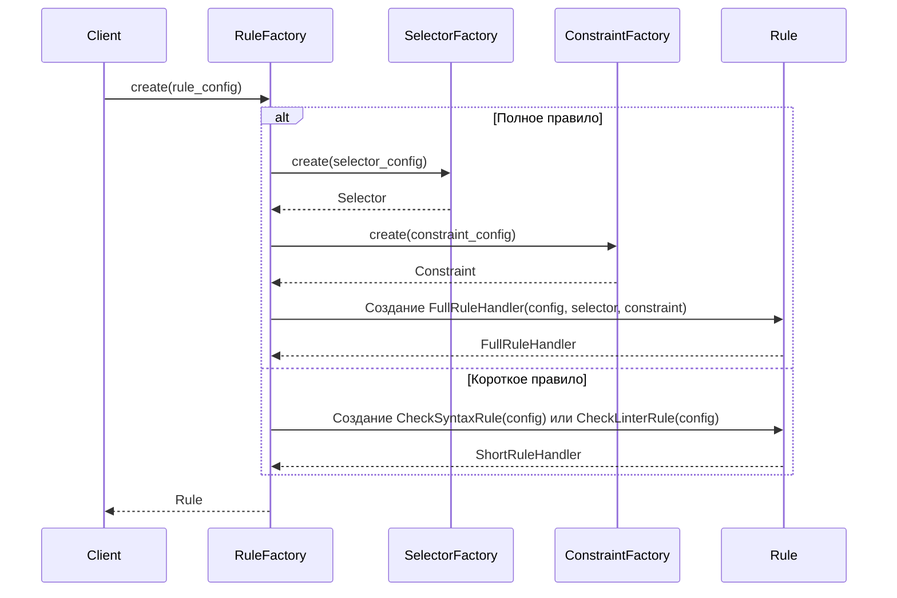

# Chapter 5: Фабрика (Factory)

В [Chapter 4: Правило (Rule)](04_правило__rule__.md) мы узнали, как определяются правила для валидации кода. Но кто
создает эти правила? Как создаются [Селекторы (Selector)](07_селектор__selector__.md)
и [Ограничения (Constraint)](09_ограничение__constraint__.md), которые составляют правила? Вот где нам понадобится
Фабрика!

Представьте, что у вас есть мастерская по изготовлению игрушек. Вместо того, чтобы собирать каждую игрушку вручную, у
вас есть специальные станки, которые делают разные детали.  **Фабрика** в `PythonCodeValidator` — это как эта
мастерская. Она получает данные из конфигурационного файла (где описаны правила) и создает нужные
объекты: [Правила (Rule)](04_правило__rule.md), [Селекторы (Selector)](07_селектор__selector.md), [Ограничения (Constraint)](09_ограничение__constraint.md).

**Зачем нужна Фабрика?**

Представьте, что вам нужно добавить новое правило проверки, например, запретить использование конструкции `if True:`.
Без фабрики вам пришлось бы лезть в код валидатора и вручную создавать объекты для этого правила. Это сложно и чревато
ошибками!

Фабрика решает эту проблему, централизуя процесс создания объектов. Мы просто добавляем описание нового правила в
конфигурационный файл, и фабрика сама создаст все необходимые объекты.

**Центральный пример использования:**

Допустим, у нас есть конфигурационный файл (`my_rules.json`), в котором описано правило, требующее наличия хотя бы одной
функции с именем `process_data`. Фабрика берет это описание из файла и создает
объект [Правило (Rule)](04_правило__rule.md), содержащий [Селектор (Selector)](07_селектор__selector.md), который ищет
функции с именем `process_data`, и [Ограничение (Constraint)](09_ограничение__constraint.md), которое проверяет, что
такие функции существуют.

**Ключевые концепции Фабрики:**

1. **Абстрактная фабрика:** В нашем случае, это концепция "фабрики", которая может создавать разные типы объектов. Она
   определяет интерфейс, но не реализует его.
2. **Конкретные фабрики:** Это реализации абстрактной фабрики. Например:
    * `RuleFactory`: Создает объекты [Правило (Rule)](04_правило__rule.md).
    * `SelectorFactory`: Создает объекты [Селектор (Selector)](07_селектор__selector.md).
    * `ConstraintFactory`: Создает объекты [Ограничение (Constraint)](09_ограничение__constraint.md).
3. **Продукт:** Это объекты, которые создаются
   фабриками: [Правила (Rule)](04_правило__rule.md), [Селекторы (Selector)](07_селектор__selector.md), [Ограничения (Constraint)](09_ограничение__constraint.md).

**Как использовать Фабрику:**

В `PythonCodeValidator`, у нас есть `RuleFactory`, которая использует `SelectorFactory` и `ConstraintFactory`. Чтобы
создать [Правило (Rule)](04_правило__rule.md), нам нужно:

1. Создать объект `RuleFactory`, передав ему `Console` (для вывода сообщений).
2. Передать фабрике конфигурацию правила (из файла `my_rules.json`).
3. Фабрика создаст нужный объект [Правило (Rule)](04_правило__rule.md).

```python
from src.code_validator.components.factories import RuleFactory
from src.code_validator.output import Console, setup_logging
from src.code_validator.config import LogLevel

# 1. Создание Console
logger = setup_logging(LogLevel.CRITICAL)
console = Console(logger, is_silent=False)

# 2. Создание RuleFactory
rule_factory = RuleFactory(console)

# 3. Конфигурация правила (пример)
rule_config = {
    "rule_id": 456,
    "message": "Отсутствует функция 'process_data'!",
    "check": {
        "selector": {
            "type": "function_def",
            "name": "process_data"
        },
        "constraint": {
            "type": "is_required"
        }
    }
}

# 4. Создание правила
rule = rule_factory.create(rule_config)

# Теперь у нас есть объект rule, готовый к использованию!
```

Этот код создает экземпляр `RuleFactory`, используя `Console`. Затем он использует конфигурацию `rule_config` для
создания объекта [Правило (Rule)](04_правило__rule.md) с помощью метода `create()`.

Что произойдет при запуске этого кода?

* `RuleFactory` получит конфигурацию правила.
* Он определит, что это "полное правило" (так как есть ключи `check`, `selector`, `constraint`).
* Он использует `SelectorFactory` для создания [Селектора (Selector)](07_селектор__selector.md), который ищет функции с
  именем `process_data`.
* Он использует `ConstraintFactory` для создания [Ограничения (Constraint)](09_ограничение__constraint.md), которое
  проверяет, что такие функции существуют.
* Он создаст объект `FullRuleHandler`, который использует [Селектор (Selector)](07_селектор__selector.md)
  и [Ограничение (Constraint)](09_ограничение__constraint.md) для проверки кода.

**Внутренняя реализация Фабрики:**

Давайте посмотрим, что происходит "под капотом", когда мы просим фабрику создать объект.

**Шаги работы (без кода):**

1. Клиент (например, `StaticValidator` из [Chapter 3: Валидатор (Validator)](03_валидатор__validator__.md)) вызывает
   метод `create()` фабрики (`RuleFactory`).
2. Фабрика (`RuleFactory`) анализирует конфигурацию, чтобы определить, какой тип объекта нужно
   создать ([Правило (Rule)](04_правило__rule.md), [Селектор (Selector)](07_селектор__selector.md), [Ограничение (Constraint)](09_ограничение__constraint.md)).
3. Если нужно создать "полное правило", фабрика использует `SelectorFactory` и `ConstraintFactory` для
   создания [Селектора (Selector)](07_селектор__selector.md)
   и [Ограничения (Constraint)](09_ограничение__constraint.md).
4. Фабрика создает и возвращает нужный объект.

**Упрощенная диаграмма последовательности:**



**Пример кода из `src\code_validator\components\factories.py`:**

Давайте посмотрим на код, чтобы лучше понять, как это работает:

```python
# src/code_validator/components/factories.py

class RuleFactory:
    def create(self, rule_config: dict[str, Any]) -> Rule:
        """Creates a specific rule instance based on its configuration."""
        if "check" in rule_config:  # Это полное правило
            raw_selector_cfg = rule_config["check"]["selector"]
            raw_constraint_cfg = rule_config["check"]["constraint"]

            selector = self._selector_factory.create(raw_selector_cfg)  # Используем SelectorFactory
            constraint = self._constraint_factory.create(raw_constraint_cfg)  # Используем ConstraintFactory

            # ... (создание FullRuleHandler)

        elif "type" in rule_config:  # Это короткое правило
            # ... (создание CheckSyntaxRule или CheckLinterRule)
            pass
        else:
            raise RuleParsingError("Rule must contain 'type' or 'check' key.")
```

Этот код показывает, как `RuleFactory` определяет, какой тип правила нужно создать, и использует `SelectorFactory` и
`ConstraintFactory` для создания [Селектора (Selector)](07_селектор__selector.md)
и [Ограничения (Constraint)](09_ограничение__constraint.md) для "полного правила".

```python
# src/code_validator/components/factories.py

class SelectorFactory:
    @staticmethod
    def create(selector_config: dict[str, Any]) -> Selector:
        """Creates a specific selector instance based on its type."""
        match selector_config["type"]:
            case "function_def":
                return FunctionDefSelector(name=selector_config["name"])  # Создаем FunctionDefSelector
            # ... (другие типы селекторов)
            case _:
                raise RuleParsingError(f"Unknown selector type: '{selector_config['type']}'")
```

Этот код показывает, как `SelectorFactory` создает [Селектор (Selector)](07_селектор__selector.md) в зависимости от
типа, указанного в конфигурации.

**Заключение:**

В этой главе мы познакомились с Фабрикой – механизмом, который создает
объекты [Правило (Rule)](04_правило__rule.md), [Селектор (Selector)](07_селектор__selector.md)
и [Ограничение (Constraint)](09_ограничение__constraint.md). Мы узнали, зачем нужна фабрика, какие типы фабрик
существуют, и как использовать `RuleFactory` для создания правил. Теперь вы понимаете, как `PythonCodeValidator` создает
правила из конфигурационного файла!

В следующей главе мы подробно рассмотрим [Chapter 6: AST (Abstract Syntax Tree)](06_ast__abstract_syntax_tree__.md) и
узнаем, как код представляется в виде дерева для анализа.