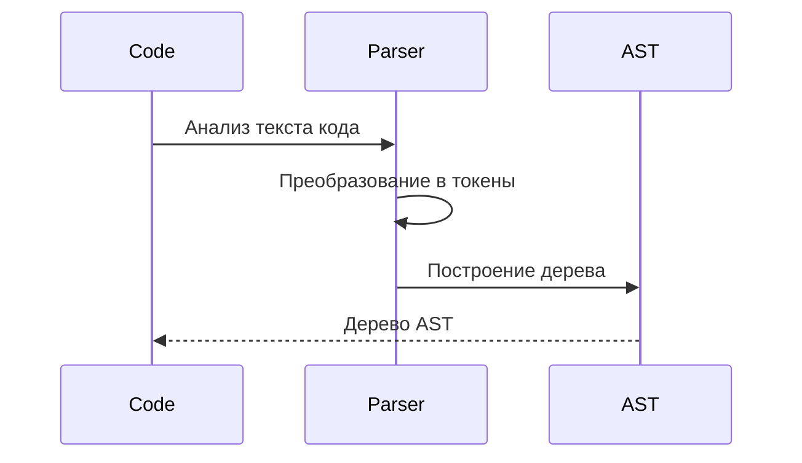

# Chapter 6: AST (Abstract Syntax Tree)

В [Chapter 5: Фабрика (Factory)](05_фабрика__factory__.md) мы узнали, как создаются объекты правил. Теперь давайте
посмотрим, на что эти правила опираются, чтобы понимать структуру нашего кода. Здесь на помощь приходит AST (Abstract
Syntax Tree)!

AST – это как рентгеновский снимок вашего Python-кода. Он показывает структуру кода, как дерево, где каждая ветка – это
часть кода: функция, класс, переменная и т.д.

**Зачем нужен AST?**

Представьте, что вы хотите найти все функции в коде, которые используют определенную переменную. Без AST вам пришлось бы
анализировать текст кода, что очень сложно и ненадежно. AST представляет код в структурированном виде, что позволяет
легко находить и анализировать нужные элементы.

**Центральный пример использования:**

Допустим, у вас есть Python-файл (`my_program.py`) и вы хотите проверить, есть ли в нем функция с именем
`calculate_tax`. Вместо того, чтобы искать текст "def calculate_tax", вы можете использовать AST, чтобы найти
определения функций с именем `calculate_tax` более надежным способом.

**Ключевые концепции AST:**

1. **Узел (Node):** Каждый элемент кода (функция, класс, переменная, оператор) представлен в AST как узел.
2. **Дерево (Tree):** Узлы связаны между собой, образуя дерево, которое отражает структуру кода. Верхний узел (корень
   дерева) – это обычно модуль (весь файл).
3. **Тип узла (Node Type):** Каждый узел имеет тип, который определяет, что он представляет (например, `FunctionDef` для
   определения функции, `Name` для имени переменной).
4. **Атрибуты узла (Node Attributes):** Каждый узел имеет атрибуты, которые содержат информацию о нем (например, имя
   функции, значение переменной).

**Как использовать AST:**

Python предоставляет встроенный модуль `ast` для работы с AST.

1. **Разбор кода (Parsing):** Сначала нужно преобразовать код в AST с помощью функции `ast.parse()`.
2. **Обход дерева (Walking):** Затем можно обходить дерево, посещая каждый узел. Для этого можно использовать функцию
   `ast.walk()`.
3. **Анализ узлов (Analyzing):** При посещении узла можно проверять его тип и атрибуты, чтобы найти нужные элементы.

```python
import ast

# 1. Код для анализа
code = """
def calculate_tax(income):
    tax = income * 0.1
    return tax
"""

# 2. Разбор кода в AST
tree = ast.parse(code)

# 3. Обход дерева и поиск функций
for node in ast.walk(tree):
    if isinstance(node, ast.FunctionDef):  # Проверяем, является ли узел определением функции
        print(f"Найдена функция: {node.name}")  # Выводим имя функции

# Вывод: Найдена функция: calculate_tax
```

Этот код сначала разбирает строку кода в AST. Затем он обходит дерево и ищет узлы типа `FunctionDef` (определение
функции). Когда такой узел найден, выводится имя функции.

В `PythonCodeValidator`, AST используется для поиска элементов кода, которые нужно проверить, на соответствие
правилам.  [Селекторы (Selector)](07_селектор__selector__.md) используют AST для выбора узлов,
а [Ограничения (Constraint)](09_ограничение__constraint__.md) используют выбранные узлы для выполнения проверок.

**Пример с AST и селектором:**

Предположим, у нас есть [Селектор (Selector)](07_селектор__selector.md), который должен выбрать все определения функций
с именем `calculate_tax`. Этот селектор использует AST для поиска таких определений функций. Сначала код преобразуется в
AST. Затем [Селектор (Selector)](07_селектор__selector.md) обходит AST и ищет узлы типа `FunctionDef` с атрибутом
`name`, равным `calculate_tax`. Найденные узлы возвращаются в качестве результата.

**Внутренняя реализация AST:**

Когда вы запускаете `ast.parse()`, что происходит под капотом?

**Шаги работы (без кода):**

1. Python использует свой парсер для анализа текста кода.
2. Парсер преобразует текст кода в последовательность токенов (ключевые слова, операторы, имена переменных и т.д.).
3. Токены используются для построения AST. Каждый токен соответствует определенному узлу в дереве.
4. AST возвращается в качестве результата.

**Упрощенная диаграмма последовательности:**



**Пример кода из `src\code_validator\components\ast_utils.py`:**

Давайте посмотрим на некоторые фрагменты кода, которые используются в `PythonCodeValidator` для работы с AST:

```python
# src/code_validator/components/ast_utils.py

import ast


def enrich_ast_with_parents(tree: ast.Module) -> None:
    """Добавляет атрибут 'parent' к каждому узлу AST."""
    for node in ast.walk(tree):
        for child in ast.iter_child_nodes(node):
            child.parent = node
```

Эта функция добавляет атрибут `parent` к каждому узлу AST, указывающий на его родительский узел. Это упрощает
перемещение по дереву вверх и определение контекста узла. Это полезно для более сложных проверок. Другими словами, если
у нас есть узел, представляющий переменную, мы можем легко найти функцию, в которой эта переменная определена, посмотрев
на родительские узлы.

```python
# src/code_validator/components/ast_utils.py

def get_full_name(node: ast.AST) -> str | None:
    """Рекурсивно строит полное имя атрибута из узла AST."""
    if isinstance(node, ast.Name):
        return node.id
    if isinstance(node, ast.Attribute):
        base = get_full_name(node.value)
        return f"{base}.{node.attr}" if base else node.attr
    return None
```

Эта функция получает полное имя атрибута (например, `foo.bar.baz`) из узла AST. Это полезно для поиска атрибутов с
определенным именем.

**Заключение:**

В этой главе мы познакомились с AST (Abstract Syntax Tree) – древовидным представлением кода, которое упрощает анализ.
Мы узнали, что такое узлы, типы узлов и атрибуты узлов. Мы увидели, как использовать модуль `ast` для разбора кода в AST
и обхода дерева. Теперь вы понимаете, как `PythonCodeValidator` использует AST для анализа кода и проверки его на
соответствие правилам!

В следующей главе мы подробно рассмотрим [Chapter 7: Селектор (Selector)](07_селектор__selector__.md) и узнаем, как
выбирать нужные узлы из AST.