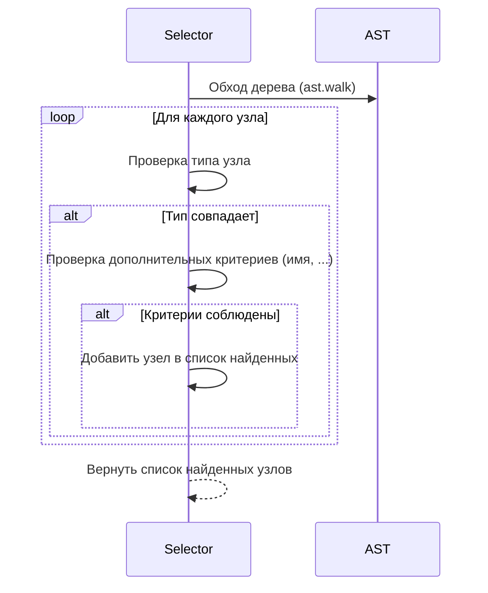

# Chapter 7: Селектор (Selector)

В [Chapter 6: AST (Abstract Syntax Tree)](06_ast__abstract_syntax_tree__.md) мы узнали, как представлять наш код в виде
дерева. Но как нам найти в этом дереве нужные элементы, чтобы проверить их? Встречайте: Селектор!

Селектор — это как поисковая система для вашего кода. Он позволяет вам находить определенные элементы в AST, например,
все определения функций или все вызовы `print()`. Представьте, что у вас есть огромная библиотека (ваш код), и вам нужно
найти все книги определенного автора (определенные элементы кода). Селектор — это ваш личный библиотекарь, который
быстро и точно найдет все, что вам нужно.

**Зачем нужен Селектор?**

Основная проблема, которую решает селектор, — это предоставление способа поиска определенных элементов в
структурированном представлении кода (AST). Вместо того чтобы вручную обходить AST и проверять каждый узел, мы можем
использовать селектор для автоматического поиска нужных узлов.

**Центральный пример использования:**

Допустим, мы хотим убедиться, что в нашем коде нет ни одного вызова функции `eval()`. Функция `eval()` может быть
опасной, поэтому мы хотим ее запретить. Мы можем создать селектор, который ищет все вызовы функции `eval()`. Если
селектор находит такие вызовы, мы можем сообщить об ошибке.

**Ключевые концепции Селектора:**

1. **Тип узла (Node Type):**  Селектор указывает, какой тип узла AST нужно искать. Например, `FunctionDef` (определение
   функции), `Call` (вызов функции), `Name` (имя переменной).
2. **Критерии поиска (Search Criteria):** Селектор может иметь дополнительные критерии для фильтрации узлов. Например,
   имя функции, имя переменной, значение литерала.
3. **Область видимости (Scope):**  Селектор может искать узлы только в определенной области видимости (например, внутри
   определенной функции или класса).

**Как использовать Селектор:**

В `PythonCodeValidator`, все селекторы реализуют интерфейс `Selector` (определен в
`src\code_validator\components\definitions.py`). Чтобы создать и использовать селектор, нужно:

1. Выбрать нужный тип селектора (например, `FunctionCallSelector` для поиска вызовов функций).
2. Создать объект селектора, передав ему необходимые параметры (например, имя функции, которую нужно найти).
3. Вызвать метод `select()`, передав ему AST кода. Метод вернет список найденных узлов.

```python
import ast
from src.code_validator.rules_library.selector_nodes import FunctionCallSelector

# 1. Код для анализа
code = "print('Hello, world!')"
tree = ast.parse(code)  # Преобразуем код в AST

# 2. Создаем селектор для поиска вызовов функции print()
selector = FunctionCallSelector(name="print")

# 3. Запускаем селектор на AST
found_nodes = selector.select(tree)

# 4. Проверяем результат
if found_nodes:
    print("Найден вызов функции print()!")
else:
    print("Вызов функции print() не найден.")
```

Этот код создает объект `FunctionCallSelector`, который ищет вызовы функции `print()`. Затем он вызывает метод
`select()` для поиска вызовов `print()` в AST. В данном случае, в коде действительно есть вызов `print()`, поэтому
программа выведет "Найден вызов функции print()!".

Давайте рассмотрим другие примеры селекторов:

* `FunctionDefSelector`: Находит определения функций. Например, `FunctionDefSelector(name="my_function")` найдет функцию
  с именем `my_function`.
* `ClassDefSelector`: Находит определения классов. Например, `ClassDefSelector(name="MyClass")` найдет класс с именем
  `MyClass`.
* `ImportStatementSelector`: Находит операторы `import`. Например, `ImportStatementSelector(name="os")` найдет
  `import os` или `from os import path`.
* `AssignmentSelector`: Находит присваивания переменных. Например, `AssignmentSelector(name="my_variable")` найдет
  `my_variable = 10`.

**Пример конфигурации селектора в `my_rules.json`:**

```json
{
  "selector": {
    "type": "function_def",
    "name": "calculate_tax"
  }
}
```

В этом примере, `type` указывает на тип селектора (`function_def`), а `name` указывает на имя функции, которую нужно
найти (`calculate_tax`).

**Внутренняя реализация Селектора:**

Когда вы вызываете метод `select()`, что происходит под капотом?

**Шаги работы (без кода):**

1. Метод `select()` обходит AST кода, начиная с корневого узла. Он использует `ast.walk()` для обхода дерева.
2. Для каждого узла он проверяет его тип.
3. Если тип узла соответствует типу, указанному в селекторе, он проверяет дополнительные критерии (например, имя
   функции).
4. Если узел соответствует всем критериям, он добавляется в список найденных узлов.
5. Метод `select()` возвращает список найденных узлов.

**Упрощенная диаграмма последовательности:**



**Пример кода из `src\code_validator\rules_library\selector_nodes.py` (FunctionCallSelector):**

Давайте посмотрим на код `FunctionCallSelector`, чтобы лучше понять, как это работает:

```python
# src/code_validator/rules_library/selector_nodes.py
import ast


class FunctionCallSelector:
    def __init__(self, **kwargs):
        self.name_to_find = kwargs.get("name")  # Сохраняем имя функции для поиска

    def select(self, tree: ast.Module) -> list[ast.AST]:
        found_nodes = []
        for node in ast.walk(tree):  # Обходим AST
            if isinstance(node, ast.Call):  # Проверяем, является ли узел вызовом функции
                # Используем helper, чтобы получить полное имя вызываемой функции
                full_name = get_full_name(node.func)
                if full_name and full_name == self.name_to_find:  # Проверяем имя функции
                    found_nodes.append(node)  # Добавляем узел в список найденных
        return found_nodes
```

Этот код показывает, как `FunctionCallSelector` обходит AST, проверяет, является ли узел вызовом функции, и проверяет
имя функции. Если все условия выполнены, узел добавляется в список найденных узлов. Функция `get_full_name()` берет
полное имя, например, `module.function`.

**Заключение:**

В этой главе мы познакомились с Селектором – инструментом для поиска нужных элементов в AST. Мы узнали, какие типы
селекторов существуют, как использовать селекторы для поиска определенных элементов кода, и как селекторы работают "под
капотом". Теперь вы понимаете, как `PythonCodeValidator` использует селекторы для выбора узлов AST!

В следующей главе мы подробно
рассмотрим [Chapter 8: Обработчик области видимости (Scope Handler)](08_обработчик_области_видимости__scope_handler__.md)
и узнаем, как ограничить поиск селектора определенной областью видимости.