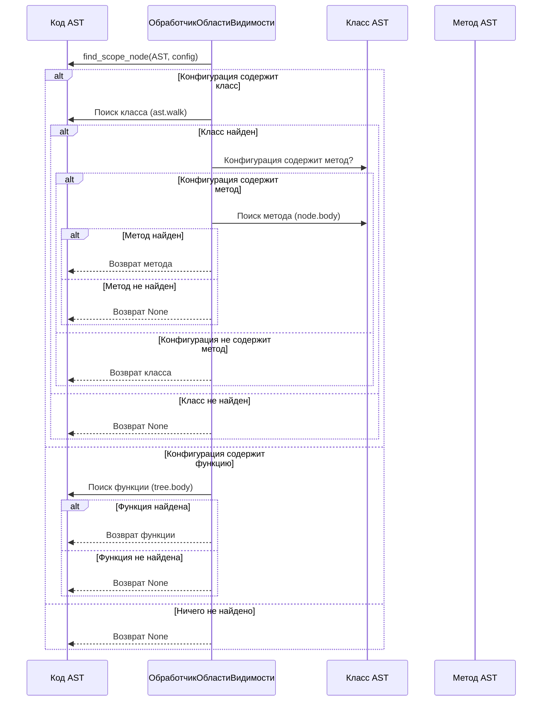

# Chapter 8: Обработчик области видимости (Scope Handler)

В [Chapter 7: Селектор (Selector)](07_селектор__selector__.md) мы изучили, как находить определенные элементы в AST. Но
что, если нам нужно искать элементы только в определенной части кода, например, внутри конкретной функции или класса?
Именно здесь в игру вступает Обработчик области видимости!

Представьте, что вы ищете определенную книгу в библиотеке. Селектор — это поиск по всей библиотеке. А Обработчик области
видимости позволяет вам сначала выбрать конкретный раздел (например, раздел "Фантастика"), а затем уже искать книгу
только в этом разделе.

**Зачем нужен Обработчик области видимости?**

Допустим, вы хотите проверить, чтобы во всех методах класса `MyClass` обязательно использовалась переменная `self`. Если
просто использовать селектор, он будет искать эту переменную во всем коде, что даст ложные срабатывания. Обработчик
области видимости позволяет сначала найти класс `MyClass`, а затем уже проверять наличие переменной `self` только внутри
этого класса.

**Центральный пример использования:**

Мы хотим проверить, чтобы все методы класса `MyClass` имели документацию (docstring). Для этого нам нужно:

1. Найти определение класса `MyClass`.
2. Для каждого метода внутри `MyClass` проверить наличие docstring.

Без Обработчика области видимости нам пришлось бы вручную обходить все методы класса, что сложно и подвержено ошибкам.

**Ключевые концепции Обработчика области видимости:**

1. **Область видимости (Scope):** Определенная часть кода, в которой нужно искать элементы. Это может быть функция,
   класс, метод и т.д. Думайте об этом как об "окружении" кода.
2. **Конфигурация области видимости (Scope Configuration):**  Описание того, какую область видимости нужно найти.
   Например, имя класса, имя функции. Это инструкция для поиска нужного "раздела" кода.
3. **Поиск узла области видимости (Finding Scope Node):** Функция, которая находит узел AST, соответствующий указанной
   области видимости. Это как найти вход в нужный "раздел" библиотеки.

**Как использовать Обработчик области видимости:**

В `PythonCodeValidator` Обработчик области видимости реализован с помощью функции `find_scope_node` в файле
`src\code_validator\components\scope_handler.py`. Эта функция принимает AST и конфигурацию области видимости и
возвращает узел AST, соответствующий этой области видимости (или `None`, если область видимости не найдена).

```python
import ast
from src.code_validator.components.scope_handler import find_scope_node

# 1. Код для анализа
code = """
class MyClass:
    def my_method(self):
        pass
"""
tree = ast.parse(code)

# 2. Конфигурация области видимости
scope_config = {"class": "MyClass", "method": "my_method"}

# 3. Поиск узла области видимости
scope_node = find_scope_node(tree, scope_config)

# 4. Проверка результата
if scope_node:
    print("Найдена область видимости!")
    print(f"Тип узла: {type(scope_node)}")
    print(f"Имя узла: {scope_node.name}")  # type: ignore
else:
    print("Область видимости не найдена.")
```

Этот код сначала создает AST из строки кода. Затем он определяет конфигурацию области видимости, указывая, что нужно
найти метод `my_method` внутри класса `MyClass`. Функция `find_scope_node` ищет этот метод в AST. Если метод найден,
программа выводит информацию о нем.

**Примеры конфигураций области видимости:**

* `{"function": "my_function"}`: Найти глобальную функцию с именем `my_function`.
* `{"class": "MyClass"}`: Найти класс с именем `MyClass`.
* `{"class": "MyClass", "method": "my_method"}`: Найти метод `my_method` внутри класса `MyClass`.

**Пример конфигурации правила в `my_rules.json` с использованием области видимости:**

```json
{
  "rule_id": 789,
  "message": "Метод 'my_method' должен иметь docstring!",
  "in_scope": {
    "class": "MyClass",
    "method": "my_method"
  },
  "check": {
    "selector": {
      "type": "function_def",
      "name": "my_method"
    },
    "constraint": {
      "type": "has_docstring"
    }
  }
}
```

В этом примере, `in_scope` указывает на область видимости, в которой нужно выполнять проверку. `selector` выберет
функцию с именем `my_method`, но *только* внутри области видимости, определенной в `in_scope`. `constraint` (которого мы
коснемся в [Chapter 9: Ограничение (Constraint)](09_ограничение__constraint__.md)) проверит, имеет ли найденная функция
docstring.

**Внутренняя реализация Обработчика области видимости:**

Что происходит под капотом, когда вы вызываете `find_scope_node()`?

**Шаги работы (без кода):**

1. Функция `find_scope_node()` получает AST и конфигурацию области видимости.
2. Она проверяет, указано ли имя класса в конфигурации.
    * Если указано, она обходит AST и ищет определение класса с указанным именем.
    * Если класс найден, она проверяет, указано ли имя метода.
        * Если указано, она ищет определение метода с указанным именем внутри класса.
        * Если метод найден, он возвращается.
    * Если класс не найден или метод не найден, возвращается `None`.
3. Если имя класса не указано, функция проверяет, указано ли имя функции.
    * Если указано, она ищет глобальную функцию с указанным именем.
    * Если функция найдена, она возвращается.
4. Если ничего не найдено, возвращается `None`.

**Упрощенная диаграмма последовательности:**



**Пример кода из `src\code_validator\components\scope_handler.py`:**

Давайте посмотрим на код функции `find_scope_node()`, чтобы лучше понять, как она работает:

```python
# src/code_validator/components/scope_handler.py
import ast
from typing import Any


def find_scope_node(tree: ast.Module, scope_config: dict[str, Any]) -> ast.AST | None:
    """Находит узел определенной области видимости (класс или функция) внутри AST."""
    class_name = scope_config.get("class")
    if class_name:
        for node in ast.walk(tree):
            if isinstance(node, ast.ClassDef) and node.name == class_name:
                # Если нужна только область видимости класса, возвращаем ее.
                if "method" not in scope_config:
                    return node

                # Если нужен метод, ищем внутри тела класса.
                method_name = scope_config.get("method")
                for item in node.body:
                    if isinstance(item, ast.FunctionDef) and item.name == method_name:
                        return item
                return None  # Класс был найден, но метод не найден.

    function_name = scope_config.get("function")
    if function_name:
        # Для глобальных функций ищем только в теле модуля верхнего уровня.
        for node in tree.body:
            if isinstance(node, ast.FunctionDef) and node.name == function_name:
                return node

    return None
```

Этот код показывает, как функция `find_scope_node()` обходит AST, ищет классы и методы и возвращает нужный узел.

**Заключение:**

В этой главе мы познакомились с Обработчиком области видимости – инструментом, который позволяет ограничить поиск
селектора определенной частью кода. Мы узнали, что такое область видимости, как использовать `find_scope_node()` для
поиска узлов области видимости, и как Обработчик области видимости работает "под капотом". Теперь вы понимаете, как
`PythonCodeValidator` использует Обработчик области видимости для более точного анализа кода!

В следующей главе мы подробно рассмотрим [Chapter 9: Ограничение (Constraint)](09_ограничение__constraint__.md) и
узнаем, как проверять, соответствуют ли выбранные узлы определенным требованиям.