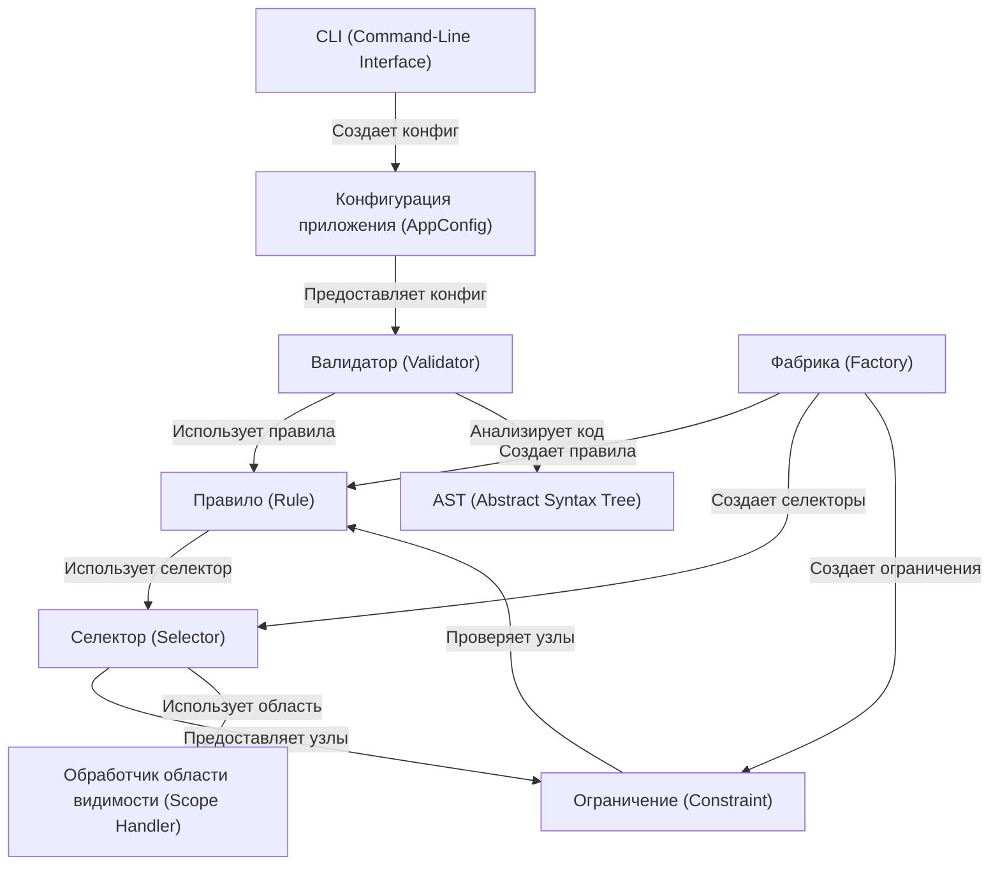

# Tutorial: PythonCodeValidator

Этот проект - **Валидатор кода на Python**. Он как *учитель*, который проверяет, правильно ли написан код студента,
используя набор правил. Если в коде есть ошибки, валидатор сообщает о них, чтобы студент мог все исправить.

**Source Repository:** [Python Code Validator](https://github.com/Qu1nle/PythonCodeValidator)

## Chapters

1. [CLI (Command-Line Interface)
   ](01_cli__command_line_interface__.md)
2. [Конфигурация приложения (AppConfig)
   ](02_конфигурация_приложения__appconfig__.md)
3. [Валидатор (Validator)
   ](03_валидатор__validator__.md)
4. [Правило (Rule)
   ](04_правило__rule__.md)
5. [Фабрика (Factory)
   ](05_фабрика__factory__.md)
6. [AST (Abstract Syntax Tree)
   ](06_ast__abstract_syntax_tree__.md)
7. [Селектор (Selector)
   ](07_селектор__selector__.md)
8. [Обработчик области видимости (Scope Handler)
   ](08_обработчик_области_видимости__scope_handler__.md)
9. [Ограничение (Constraint)
   ](09_ограничение__constraint__.md)